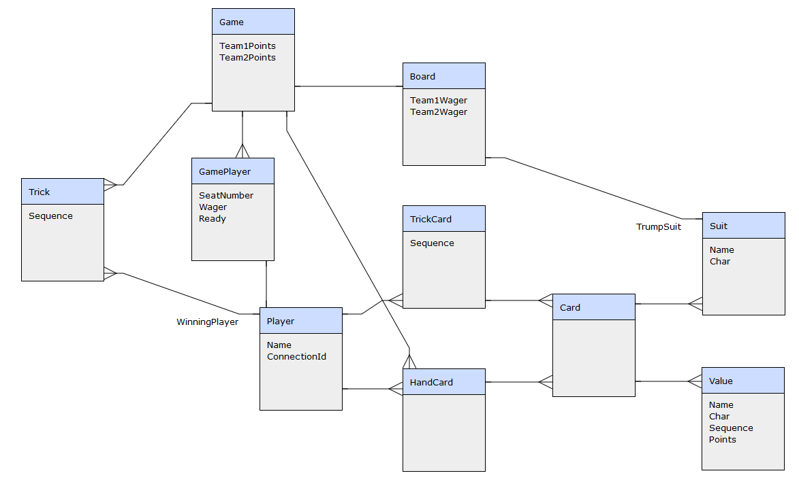
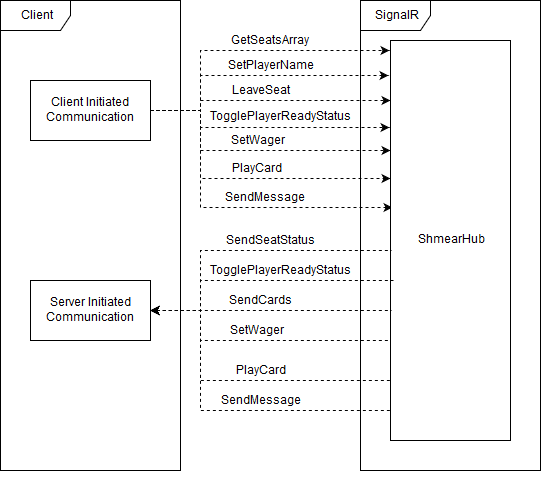
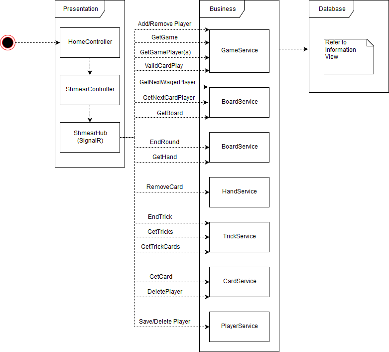

# ShmearCore

ShmearCore is a proof-of-concept project for using the latest ASP.NET Core (2.1 at the ) using layered architecture with EF Core for the Data Layer and SignalR for the required Client/Server communication.  

## Getting Started

These instructions will get you a copy of the project up and running on your local machine for development and testing purposes. See deployment for notes on how to deploy the project on a live system.

## TODO List

* Finish Round
* Complete code coverage testing
* A better way to handle which seats are which team
* Computer player - improve first version of AI
* Put connection strings in JSON file
* Keep perfect history to be able to replay the entire gameplay of the session instead of resetting after each round

## Rules of the Game

* 33 Cards are included in the game
* Four players in the game, teams are determined by those sitting across the table from each other.
* All Four Suits + Joker
* Cards + order of importance: Ace, King, Queen, Jack, Joker, 10, 9, 8, 7
* After 6 cards are dealt to each Player at the beginning of each round, meaning that 11 cards are not dealt each round, each Player bids, starting with the first player dealt cards.  Each Player can either Pass, or outbid the current bid.  Five is the highest bid and if it is wagered by a Player, bidding is over.  The Player with the highest bid plays the first Card.  
* Trump beats any non-Trump.  Trump is determined as the first card played by the winning bidder (Joker not allowed as first card).
* Players must follow suit except they may Trump on any trick, meaning, they must play the same suit that was the first Card played per Trick unless they play Trump.
* Each Player plays a Card each Trick.  After each Player plays a Card, a winner is determined by power of each Card.  The Player that wins the Trick, starts the next trick.  

* After all 6 Tricks are played, points are determined.  Each of these provides one point:
    * High Card of Trump Suit (Player who plays it)
    * Low Card of Trump Suit (Player who plays it)
    * Jack of Trump Suit (Player who wins the Trick)
    * Joker of Trump Suit (Player who wins the Trick)
    * "Game" is determined by counting, for each team, the points accumilated in Tricks won for that team.  If there is a tie, no points are awarded.
* Points must equal or exceed the bid from the winning team.  If the team with the winning bid doesn't meet or exceed their bid with points earned, then they "Bust", meaning do not keep any points they earned and they earn negative points of their bid.  If the team with the winning bid meet or exceed the winning bid with the points earned, they keep all the points they earned.  The team that did not bid keeps the points they earned even though they didn't win the bid.  

## Architecture

### Information View

The Information Viewpoint describes the data storage and how the data moves around thoughout the application lifecycle.  The Information View consists of a database model and what data is needed at each important point in the application state.

Since the application is designed to be a card game, the most basic model in the database is a Card.  In Shmear, there are 33 cards in the deck.  There is a Suit attribute describing Clubs, Hearts, Spades, and Diamonds.  The other attribute of a Card is the Value.  The list of values, and in order of power is: Ace, King, Queen, Jack, Joker, Ten, Nine, Eight, and Seven.  The sequence attribute of Value describes this within the database.  Each Value card has a different score, that is also stored within the Value table.  

http://erdraw.com/graphs/859618422978/edit



* Game is the top-level object that contains the points that each team has in each round.  Currently, these points will reset after each round so the history of each round is not maintained.
* Board contains information about each hand that is dealt.  It will remember the wager so that each hand can be scored properly. 
* Player records details about each player.  The data recorded here can determine how long it's been since the Player has input something into the game.  Also, if the Player reconnects, the ConnectionId can be used to determine which game the Player was previously connected to in order to allow for reconnect.  
* GamePlayer joins Game and Player.  It also remembers if the player set themselves to Ready when the game is about to start, and their wager as the bidding is starting.  
* HandCard remembers each Card that is in the Player's hand before they play it.  There was nothing needed to be remembered about a Player's Hand that can't be quickly determined by HandCard, so there is no Table referencing Hand.
* Trick remembers who won the trick.
* TrickCard remembers who played each Card.  Though who won the Trick could be determined within the application, it requires complicated business logic to determine, so recording the winner in Trick is more valuable.  
* Card, in combination with Value and Suit, will be the reference for each of the 33 Cards in the Game.
* Suit remembers the character that can be displayed to represent that Suit as well as the name of that Suit.
* Value remembers the point value, the name, and the sequence to determine power of that card (within its Suit).

### Functional View

The architecture of the application is based on Layered pattern implemented in three layers:

* Presentation Layer using MVC and SignalR
* Business Layer using static services
* Database Layer using Entity Framework

#### Presentation Layer

The Presentation Layer contains the visual components of the application.  It provides an entry point for the user to interact with the system.  MVC provides the home page and the data entry for the Player's name.  This operation connects the connection identifier provided by SignalR with the name they provide.  

SignalR is where all the actual work is done.  SignalR connection is started after the form submission for the user's name and it provides for the server to update clients that have not initiated an action, but require changes to their user interface.  This can happen for a few different reasons.  

* When a Player joins the game
* When a Player shows as ready
* When all Players have been set to ready and the Cards are dealt
* When a Player declares their wager
* When a Player plays a card
* After the last card is played
* When a Player sends a message

The operation of SignalR is provided by javascript.  The javascript for SignalR is provided by Node Package Manager (NPM).  

```
npm init -y
npm install @aspnet/signalr
```



#### Business Layer

The Business Layer contains static services.  The reason for static services is because nothing is stored in between requests.  The Business Layer contains all the logic for what is needed to be displayed on the frontend.  The only reason the Presentation Layer needs a reference to the Data Layer is to have knowledge of the data layer models.  Though the models could be duplicated in the Business Layer to remove that reference, I do not see this dependency as a liability, since the Data Layer models would simply need to be duplicated in the Business Layer without any benefit to functionality.  



#### Data Layer

Refer to the Information View.

## Authors

* **Brandon Miller** - *Initial work*

## License

This project is licensed under the MIT License - see the [LICENSE.md](LICENSE.md) file for details