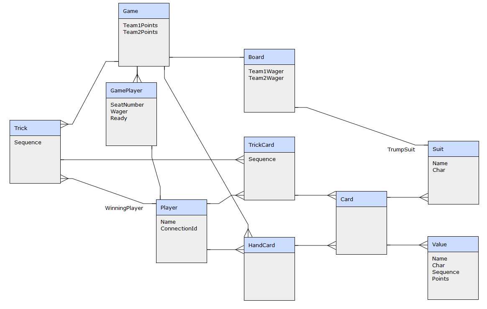
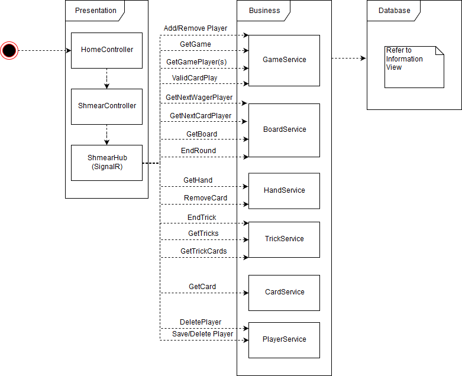

# ShmearCore

ShmearCore is a proof-of-concept project for using the latest ASP.NET Core (2.1 at the time of this authored document) using layered architecture with EF Core for the Data Layer and SignalR for the required Client/Server communication.  

## TODO List

### Minimum Viable Product (MVP)

* Finish Round
* Complete code coverage automated testing
* Update frontend to better display Cards in Hand from the perspective of the Player instead of the perspective of the table
* Update frontend to better display Cards that have been played and the state of the Game/Round

### Version 2.0

* Computer player - improve first version of AI
* Put connection strings in JSON file
* Keep perfect history to be able to replay the entire gameplay of the session instead of resetting after each round
* A better way to handle which seats are which team

## Rules of the Game

* Four Players in the game, teams are determined by alternating Players, meaning the Players to your right and left are on the opposing team.  
* 33 Cards are included in the game
* Cards + order of importance (power): Ace, King, Queen, Jack, Joker, 10, 9, 8, 7; All four Suits + Joker; Joker counts as trump suit
* After 6 cards are dealt to each Player at the beginning of each round, meaning that 11 cards are not dealt each round, each Player bids, starting with the first player dealt cards and continuing clockwise.  Each Player can either Pass, or outbid the current bid.  Five is the highest bid and if it is wagered by a Player, bidding is over.  The Player with the highest bid plays the first Card.  
* Trump beats any non-Trump.  Trump is determined as the first card played by the winning bidder (Joker not allowed as first Card of Hand).
* Players must follow Suit except they may Trump on any Trick, meaning, they must play the same Suit that was the first Card played per Trick unless they play Trump.
* Each Player plays a Card each Trick.  After each Player plays a Card, a winner is determined by the power of each Card.  The Player that wins the Trick, starts the next Trick.  
* After all 6 Tricks are played, points are determined.  Each of these provides one point:
    * High Card of Trump Suit (Player who plays it)
    * Low Card of Trump Suit (Player who plays it)
    * Jack of Trump Suit (Player who wins the Trick)
    * Joker (Player who wins the Trick)
    * "Game" is determined by counting, for each team, the score based on the Value of each Card accumulated in Tricks won for that team.  If there is a tie, no points are awarded.
* Points must equal or exceed the bid from the winning team.  If the team with the winning bid doesn't meet or exceed their bid with points earned, then they "Bust", meaning do not keep any points they earned and they earn negative points of their bid.  If the team with the winning bid meet or exceed the winning bid with the points earned, they keep all the points they earned.  The team that did not bid keeps the points they earned even though they didn't win the bid.  
* Winner of each round is determined by the first team to reach 11 points.  "Bidder goes out" means that the team that won the bid for that Hand is allowed to finish the Hand and will win if they reach 11 even though the team that didn't win the bid earns 11 points before the end of the Hand.  

## Architecture

### Information View

The Information Viewpoint describes the data storage and how the data moves around thoughout the application lifecycle.  The Information View consists of a database model and what data is needed at each important point in the application state.

http://erdraw.com/graphs/859618422978/edit



* Game is the top-level object that contains the points that each team has in each round.  Currently, these points will reset after each round so the history of each round is not maintained.
* Board contains information about each hand that is dealt.  It will remember the wager so that each hand can be scored properly. 
* Player records details about each player.  The data recorded here can determine how long it's been since the Player has input something into the game.  Also, if the Player reconnects, the ConnectionId can be used to determine which game the Player was previously connected to in order to allow for reconnect.  
* GamePlayer joins Game and Player.  It also remembers if the player sets themselves to Ready when the Game is about to start, and their wager as the bidding is starting.  
* HandCard remembers each Card that is in the Player's hand before they play it.  There was nothing needed to be remembered about a Player's Hand that can't be quickly determined by HandCard, so there is no Table referencing Hand.
* Trick remembers who won the trick.
* TrickCard remembers who played each Card.  Though who won the Trick could be determined within the application, it requires complicated business logic to determine, so recording the winner in Trick is more valuable.  
* Card, in combination with Value and Suit, will be the reference for each of the 33 Cards in the Game.
* Suit remembers the character that can be displayed to represent that Suit as well as the name of that Suit.
* Value remembers the point value, the name, and the sequence to determine power of that card (within its Suit).

### Functional View

The architecture of the application is based on Layered pattern implemented in three layers:

* Presentation Layer using MVC and SignalR
* Business Layer using static services
* Database Layer using Entity Framework Core

#### Presentation Layer

The Presentation Layer contains the visual components of the application.  It provides an entry point for the user to interact with the system.  MVC provides the home page and the data entry for the Player's name.  This operation connects the connection identifier provided by SignalR with the name they provide.  

SignalR is where all the actual work is done.  SignalR connection is started after the form submission for the user's name and it provides for the server to update clients that have not initiated an action, but require changes to their user interface.  This can happen for a few different reasons.  

* When a Player joins the game
* When a Player shows as ready
* When all Players have been set to ready and the Cards are dealt
* When a Player declares their wager
* When a Player plays a card
* After the last card is played
* When a Player sends a message

The operation of SignalR on the Client is provided by javascript.  The javascript for SignalR is provided by Node Package Manager (NPM).  The two primary operations of the SignalR javascript file is to be able to call an API function from the Client to the Server and to listen on the Client for an execution of a function from the Server.  

```
npm init -y
npm install @aspnet/signalr
```

The Server also mantains the list of Clients and allows for the Server to have the option to send to a subset of Clients (or a single Client), or all currently connected Clients.


#### Business Layer

The Business Layer contains static services.  The reason for static services is because nothing is stored in between requests.  The Business Layer contains all the CRUD logic to modify data based on requests from the frontend as well as getting the data and providing it in a format for the frontend to be able to display the current state.  The only reason the Presentation Layer needs a reference to the Data Layer is to have knowledge of the data layer models.  Though the models could be duplicated in the Business Layer to remove that reference, I do not see this dependency as a liability, since the Data Layer models would simply be duplicated in the Business Layer without any benefit to functionality.  



#### Data Layer

Refer to the Information View.

## Technology

### Entity Framework Core

Entity Framework Core is an Object Relational Mapper that can hide and automate the creation of SQL behind the usage of LINQ (Language Integrated Query) language integrated in C#.

Example of C# raw sql query (https://msdn.microsoft.com/en-us/library/fksx3b4f.aspx):

```c#
SqlConnection sqlConnection1 = new SqlConnection("Your Connection String");
SqlCommand cmd = new SqlCommand();
SqlDataReader reader;
cmd.CommandText = "SELECT * FROM Customers";
cmd.CommandType = CommandType.Text;
cmd.Connection = sqlConnection1;
sqlConnection1.Open();
reader = cmd.ExecuteReader();
// Data is accessible through the DataReader object similar to an array of arrays.
sqlConnection1.Close();
```

Example of C# Entity Framework Core query

```c#
using (var db = new CustomerDataContext()) 
{
    var customers = db.Customers.ToList();
    // Data is accessible though the Customers as a List object 
    // automatically generated to be a replica of the database table
}
```

Advantages and disadvantages of Entity Framework are listed here (same applies for Entity Framework Core):

https://social.msdn.microsoft.com/Forums/en-US/16f4db07-2b8a-42fe-94a4-924b6916984d/what-is-the-advantage-and-disadvantage-of-entity-framework?forum=adodotnetentityframework

The primary reasons for using Entity Framework:

* Easy to map business objects (single command line statement to (re)create all business objects in the domain model) as well as all relationships between those objects.  
* LINQ querying allows for rapid prototyping of CRUD operations as well as sophisticated business logic querying for proof-of-concept.

#### Testing

Entity Framework Core has dramatically eased the burden of trying to keep separate an environment for doing automated testing vs. a SQL Server development environment where I can execute and debug my application.  The benefits of using an "InMemroy" connection string from Entity Framework Core include:

* Automated creation before each test (Fact) of new DbContext which is an empty database that includes all "tables" from the model generated by Entity Framework Core.
* Automated teardown after each test (Fact) is complete.
* No dependence on SQL Server for users that want to do development and maintain 100% test success or simply want to download the project and run the automated tests.
* Single-digit ms execution times for most tests even though they each use a different DbContext.  

#### Object Relational Mapper (ORM) vs. Stored Procedure

Though Stored Procedures are faster because of their saved execution plans and raw T-SQL, the goal of this project was for a rapid prototype and proof-of-concept style development to improve my awareness of new technologies.  In my opinion, the benefit of rapid development exceeds the disadvantage of the minimal cost to execution time of Entity Framework Core queries.  If the project priorities are speed, separation of concerns of the database logic from the business logic, and database performance and efficiency, then Stored Procedures are the way to go.  If rapid development is the priority and speed and efficiency are less of a concern, Entity Framework Core is a good choice.

#### Entity Framework Core vs. Entity Framework

Although Entity Framework Core does not yet contain all the features of Entity Framework, .NET Core and in effect, Entity Framework Core, is the future of cross-platform development and deployment within the Microsoft deveopment ecosystem and appears to be where a significant portion of Microsoft's development time and research is going for the continued success and adoption of C# and .NET.  

## Authors

* **Brandon Miller**